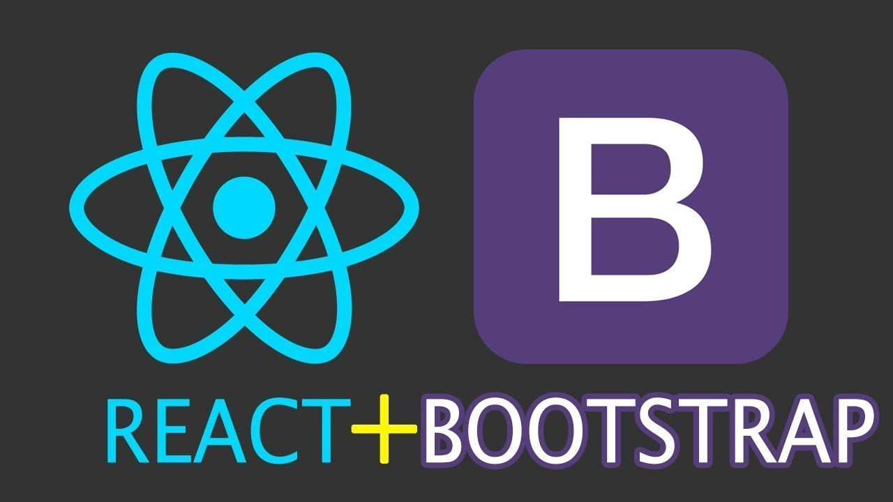
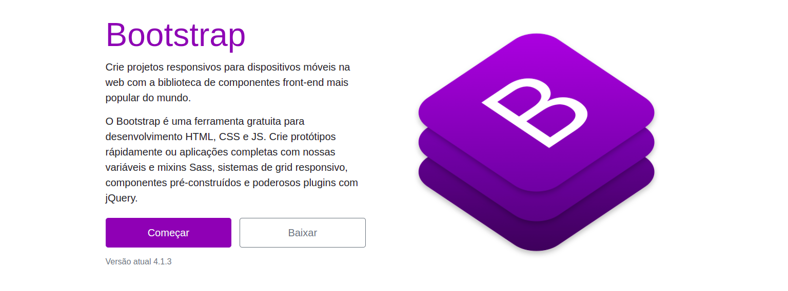
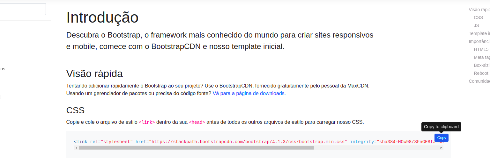
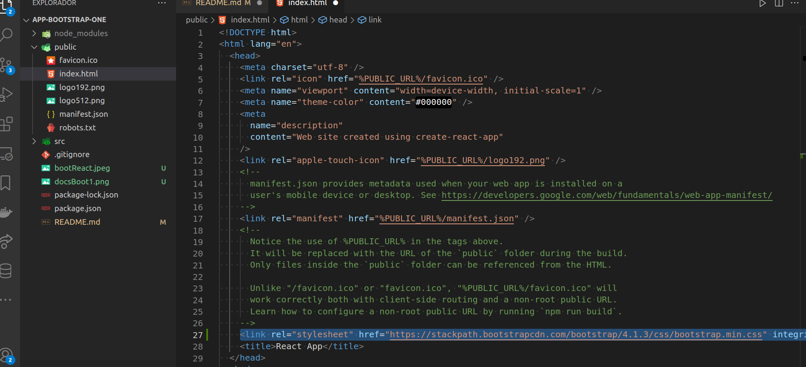
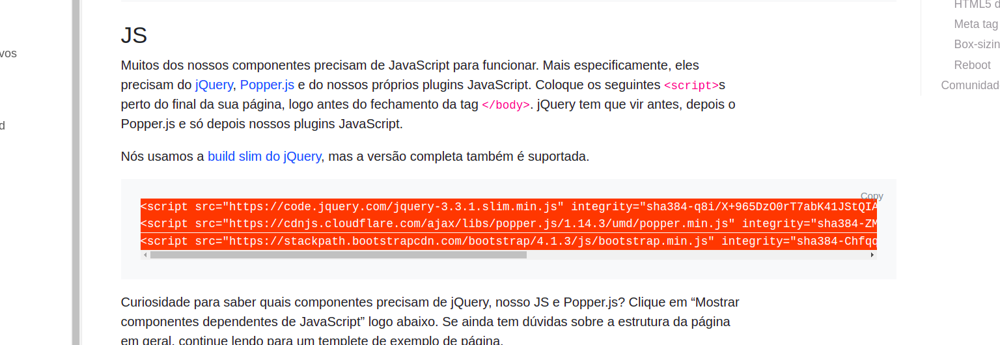
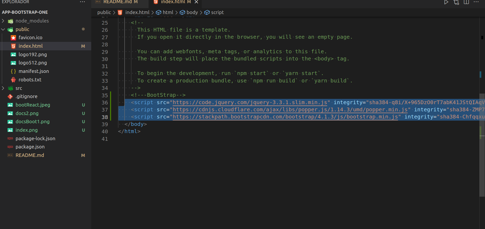

### 1 - Setup inicial ambiente do Front-End:

- [x] Criando uma Pasta front-end;

```console
mkdir BootStrapResponsive
```

- [x] - Entrando na pasta;

```console
cd BootStrapResponsive
```

- [x] - Rodando o comando npx que cria a estrutura de pastas e arquivos do front-end;

```console
npx create-react-app app-bootstrap-one
```

### 1.1 - Configurações iniciais do ambiente React/Bootstrap:

-[x] -[Acessando a documentação do BootStrap].(https://getbootstrap.com.br/)



> Dentro da pasta public criada pelo comando npx crete-react-app tem um arquivo index.html onde iremos colar a biblioteca do BootStrap na versão compacta conforme ilustrada logo abaixo:





### 1.3 - Ferramentas e pacotes que utilizaremos no desenvolvimento da aplicação(Front-End):


- [x] - axios: ^0.26.1 ;
  
```console
 npm i axios
```

- [Link Pacote npm ](https://www.npmjs.com/package/axios)


- [x] - React Icons ;

```
npm install react-icons --save
```

- [Link Documentação React Icons ](https://react-icons.github.io/react-icons)

- [Uma breve descrição da funcionalidade ](https://www.youtube.com/watch?v=ZC8Bqa2AKyY&t=234s)

```javascript
import { FaBeer } from 'react-icons/fa';
class Question extends React.Component {
  render() {
    return <h3> Lets go for a <FaBeer />? </h3>
  }
}
```
- [x] - react-router-dom: ^5.3.1;
  
```console
 npm i react-router-dom
```

- [Link Pacote react-router-dom ](https://www.npmjs.com/package/react-router-dom)


- [x] - React Toastify: ^5.1.3;
  
```console
 npm i react-toastify
```

> Uma lib que te por propósito tornar mais simples o processo de exibir notificações para o usuário.

- [Link Pacote reac-toastify ](https://www.npmjs.com/package/react-toastify)

- [Tutorial React-toastify](https://www.youtube.com/watch?v=gKXGndx1zu8)

